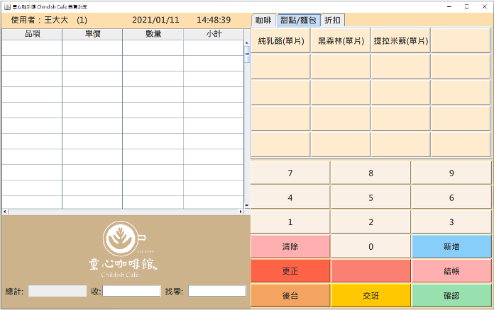

# 童心咖啡館POS系統
系統分析與設計課程專案

- [系統介面](#系統介面)
  - [登入](#登入畫面)
  - [前台](#前台畫面)
  - [後台](#後台-主頁)
  
## 系統介面
### 登入畫面
此頁面抓取資料庫員工資料，如果使用者帳密驗證成功會進入前台，反之會跳出提醒，帳號密碼錯誤，無法登入。

### 前台畫面
運用此頁面進行點餐以及結帳，透過點按旁邊的商品名稱，點按購買數量，按下結帳鈕後進行總計運算，再由使用者輸入收取多少錢，按下確認後計算出找零，並且存入資料庫。

### 後台-主頁
透過此頁面可以得知主管要傳達給所有人的消息

### 後台-庫存
透過此頁面可以查詢得知產品單價以及庫存量。

### 後台-銷售
此頁面左半邊顯示全部銷售紀錄。

雙擊左半邊想得知的銷售紀錄，或查詢銷售編號，即可在右半邊顯示當筆明細。

### 後台-人事-打卡
透過此頁面可以記錄員工上下班時間。

### 後台-人事-員工
透過此頁面可得知全部員工資料。

### 後台-管理
此管理介面只有主管可以進入。

### 後台-管理-主頁管理
主管可在此頁面新增公告。

### 後台-管理-庫存管理
此頁面可更改產品售價以及更新庫存量。

### 後台-管理-員工管理
此頁面可經由查詢員工編號，得知員工資料，且也可以新增/更新員工資料。

### 後台-管理-打卡記錄
此頁面可查詢所有日期的打卡紀錄

也可選擇日期，查詢當日打卡紀錄

